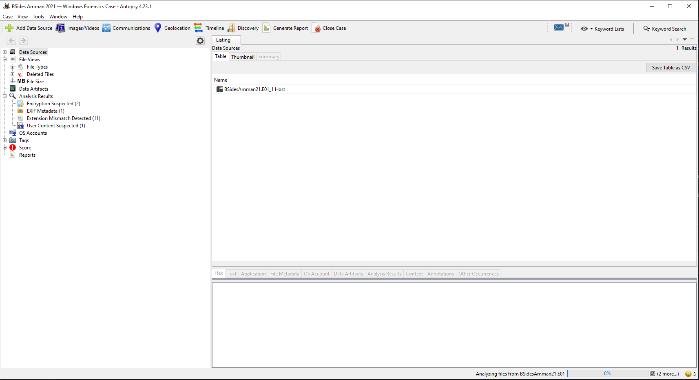
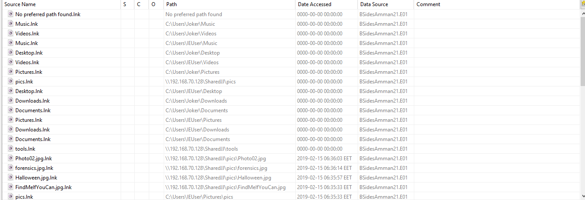
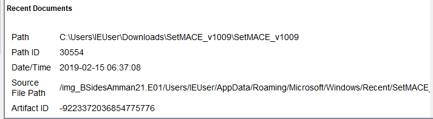
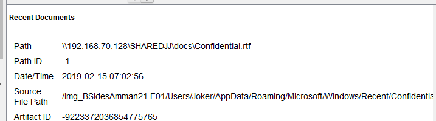
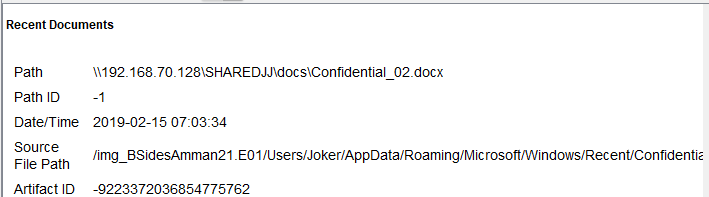
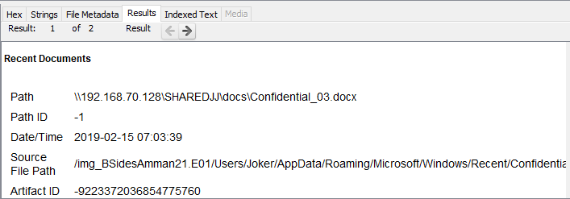
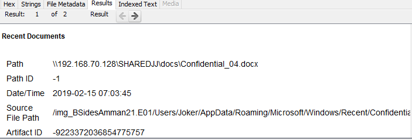
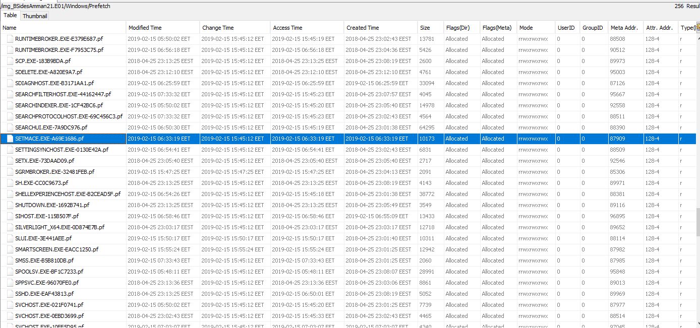

# ЦИФРОВА КРИМІНАЛІСТИКА: ЗВІТ ПРО РОЗСЛІДУВАННЯ

Цей звіт підготовлено в межах незалежного дослідження у сфері цифрової криміналістики. Він не призначений для комерційного використання.

_Автор: Сороковський А.І. - Студент літньої практики SoftServe._

# ЗВІТ ПРО РОЗСЛІДУВАННЯ: BSides Amman 2021 — Windows Forensics Case

Аналітик: Сороковський Андрій

Дата розслідування: 21.08.2026

Інструменти: Autopsy v4.2.0

## 1. Короткий огляд

Було надано систему, що використовувалася для незаконної діяльності, під час якої користувач отримав доступ до конфіденційних файлів, не маючи на це відповідних повноважень. Система має два облікові записи користувачів, які є основними об'єктами розслідування: joker та IEUser. Ваше завдання — виявити ці конфіденційні файли та надати докази несанкціонованого доступу.

## 2. Мета розслідування

- визначити конфіденційні файли, котрі отримані несанкціонованим шляхом;
- надати докази несанкціонованого доступу до цих файлів.

## 3. Методологія

- створення образу: "BSidesAmman21.E01" та завантажено в Autopsy;
- модулі обробки: метаданні, файлова система, часова шкала, нещодавня активність;
- Аналіз даних: файли .rtf, файли .link, файли .docs, видалені файли та часова шкала.

## 4. Висновки та докази

### 4.1 - Завантажений зліпок файлової системи у Autopsy
Час виконання: 15:59

Ідентифікація зліпку (Hash Verification):
Для забезпечення цілісності та незмінності наданого доказу, було обчислено криптографічний хеш(SHA256) файлу образу: `2b830de50a198b50bdd677098331270956ba41633710629923131cf8e1fbd02a`

### 4.2 - Аналіз артифактів "Recent Documents"
Час виконання 16:06

Для виконання поставленої мети було проведено аналіз гілки реєстру Windows, що відповідає за історію нещодавно відкритих файлів (RecentDocs), а також відповідних ярликів (.lnk). Ці артефакти дозволяють відновити точну послідовність дій користувачів.

Доказ доступу користувача IEUser:
На скріншоті представлено таблицю «Directory Listing» з артефактами «Recent Documents».

- Виявлено серію ярликів, що вказують на мережевий шлях (UNC): `\\192.168.70.128\SHARED\docs\....`;
- Ідентифіковані конфіденційні файли: Confidential.rtf, Confidential_02.docx, Confidential_03.docx, Confidential_04.docx;
- Доказ несанкціонованого доступу: Наявність цих записів є прямим підтвердженням того, що файли фізично відкривалися на цьому комп'ютері.

Сліди анти-криміналістики:
У тому ж списку зафіксовано використання спеціалізованого програмного забезпечення:
- SetMACE_v1009 та readme.txt: Виявлено у локальній теці `C:\Users\IEUser\Downloads\....`. Це інструмент для зміни часових міток (Modified, Accessed, Created, Entry) файлів.

### 4.3 - Хронологія подій

Завдяки точним часовим міткам зі скріншота (колонка Date/Time) було відновлено хронологію злочинних дій вранці 15 лютого 2019 року (часовий пояс EET):

| Час (EET) | Дія |
| :--- | :---: |
| 06:36:33 – 06:36:37 | Користувач відкриває зображення (forensics.jpg, FindMeIfYouCan.jpg) та системні файли (eula.txt). |
| 06:37:08 | Підготовка: Користувач відкриває readme.txt та сам інструмент SetMACE_v1009 з локальної теки завантажень. Це вказує на свідому підготовку до приховування слідів. |
| 07:02:56 – 07:03:45 | Ексфільтрація даних: Послідовно відкриваються конфіденційні файли: Confidential_rtf, Confidential_02.docx, Confidential_03.docx, Confidential_04.docx. |
| 07:04:00 – 07:25:03 | Користувач переглядає інші документи в мережі (TheMeaningOfLife.pdf, The-ProjectSauron.pdf, windows_command_line_sheet_v1) та відкриває теку docs. |
| 07:53:52 – 07:53:53 | Відкривається ярлик Joker.lnk (перехід у профіль користувача joker) та звіт mandiant-apt1-report.pdf. Це свідчить про спробу змішати активність або перекласти відповідальність на інший обліковий запис. |

### 4.4 - Детальний аналіз артефактів реєстру (Evidence Submission)
Для підтвердження знайдених даних було проведено поглиблений аналіз кожного запису в реєстрі Windows (гілка HKCU\Software\Microsoft\Windows\CurrentVersion\Explorer\RecentDocs). 

Нижче наведено детальні витяги (Artifact Properties) для ключових об'єктів розслідування.

1. Інструмент анти-криміналістики (SetMACE):
  
    - Артефакт: SetMACE_v1009
    - Шлях: C:\Users\IEUser\Downloads\SetMACE_v1009\SetMACE_v1009
    - Час: 2019-02-15 06:37:08
    - Джерело: С:/Users/IEUser/AppData/Roaming/Microsoft/Windows/Recent/SetMACE...
    Доказ: Підтверджує, що користувач IEUser завантажив та вивчав утиліту для зміни часових міток напередодні доступу до секретних даних.

2. Доступ до конфіденційних даних:
Всі ці файли знаходяться у профілі користувача Joker, що вказує на навмисне змішування активності між обліковими записами.
    1. Артефакт: Confidential.rtf
      
        - Шлях: \\192.168.70.128\SHAREDJJ\docs\Confidential.rtf
        - Час: 2019-02-15 07:02:56
        - Джерело: С:/Users/Joker/AppData/Roaming/Microsoft/Windows/Recent/...
    2. Артефакт: Confidential_02.docx
      
        - Шлях: \\192.168.70.128\SHAREDJJ\docs\Confidential_02.docx
        - Час: 2019-02-15 07:03:34
        - Джерело: C:/Users/Joker/AppData/Roaming/Microsoft/Windows/Recent/...
    3. Артефакт: Confidential_03.docx
      
        - Шлях: \\192.168.70.128\SHAREDJJ\docs\Confidential_03.docx
        - Час: 2019-02-15 07:03:34
        - Джерело: C:/Users/Joker/AppData/Roaming/Microsoft/Windows/Recent/...
    4. Артефакт: Confidential_04.docx
    
        - Шлях: \\192.168.70.128\SHAREDJJ\docs\Confidential_04.docx
        - Час: 2019-02-15 07:03:45
        - Джерело: C:/Users/Joker/AppData/Roaming/Microsoft/Windows/Recent/...

Наявність цих записів у фізичному файлі реєстру(NTUSER.DAT) є незаперечним доказом того, що файли відкривалися. Шлях SHAREDJJ та знаходження записів у профілі Joker підтверджують спробу приховати джерело реального доступу.

### 4.5 - Аналіз папки C:\Windows\Prefetch
Час виконання: 17:01
Для підтвердження того, що інструмент для зміни часових міток SetMACE був не лише завантажений, а й фактично запущений на системі, було проведено аналіз каталогу C:\Windows\Prefetch.

Результати аналізу:
    - Виявлено файл SETMACE.EXE-69E1696B.pf, що є прямим доказом виконання цієї програми.
    - Час останнього запуску (Modified Time): 2019-02-15 06:33:19 EET.
    - Час створення (Created Time): 2019-02-15 06:33:19 EET.
Значення для розслідування:
Час запуску SetMACE(06:33) передує часу доступу до конфіденційних файлів(07:02). Це підтверджує, що користувач IEUser заздалегідь підготував інструмент для приховування слідів перед тим, як здійснити несанкціонований доступ до мережевої теки. Наявність цього артефакту робить ланцюжок доказів нерозривним.

### 5. Висновок:

1. Визначені конфіденційні файли:
Об'єктами несанкціонованого доступу є файли з префіксом Confidential, що зберігаються на віддаленому сервері за адресою 192.168.70.128 у теці SHARED\docs:
    - Confidential.rtf
    - Confidential_02.docx
    - Confidential_03.docx
    - Confidential_04.docx
    - Confidential_ttf.

2. Докази несанкціонованого доступу:
    - Встановлено точний час доступу до файлів: 15 лютого 2019 року з 07:02:56 по 07:03:45 (EET).
    - Прямим доказом є наявність записів у фізичному файлі реєстру (NTUSER.DAT) у профілі користувача Joker (гілка RecentDocs), які містять точні шляхи (UNC) до цих файлів.
    - Користувач IEUser використовував прямий доступ до мережевого ресурсу (UNC-шлях) без авторизації на локальному рівні, а також завантажив інструмент SetMACE для зміни часових міток до початку ексфільтрації даних.
    - Використання SetMACE та виявлення записів про доступ у профілі Joker (тоді як сам інструмент знаходиться у IEUser) підтверджують навмисне приховування слідів та спробу перекласти відповідальність, що робить доступ незаконним.
